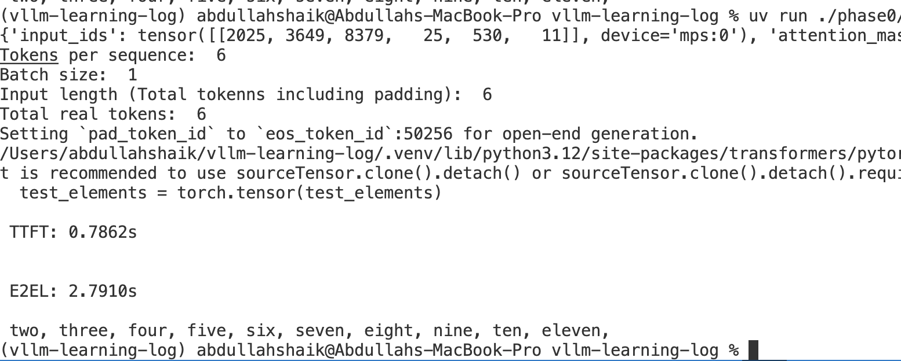

# Key metrics for LLM Inference with single request
## Phase 0 - Time To First Token
**TTFT (Time To First Token):** The time it takes to generate the first token after sending a request. It reflects how fast the model can start responding.
This metric captures:
- model loading and tokenization
- prompt prefill latency
- first decode step

TTFT was measured using streaming generation with a separate
generation thread and `TextIteratorStreamer`.

---

### Model Configuration

- **Model**: `distilgpt2`
- **Framework**: Hugging Face Transformers
- **Device**: MPS (Apple Silicon)
- **Max New Tokens**: 20


---


### Input Prompt

```text
An increasing sequence: one,
```

### Input Token Statistics

- **Batch size**: 1
- **Tokens per sequence**: 6
- **Total input tokens (including padding)**: 6
- **Total real input tokens (non-padding)**: 6

> Note: In this benchmark, batch size is 1 and no padding is applied,
> so all token counts are equal. These fields are listed separately
> to support future benchmarking with batching and variable-length inputs.

---

### Example Output


### TTFT Results

TTFT was measured across multiple runs to distinguish between **cold-start**
and **warm-start** behavior.

- **Cold-start TTFT**: **~1.08 s**  
  The first run after process startup. This includes model initialization,
  device placement on MPS, kernel compilation, and memory setup.

- **Warm-start TTFT**: **~0.86–0.90 s**  
  Subsequent runs after initialization, where kernels and memory are reused
  and the model is already resident on the device.

> **Note:** Cold-start latency is expected to be higher and is relevant for
> scenarios such as server restarts and autoscaling. Warm-start TTFT reflects
> steady-state performance and is the primary metric for ongoing inference
> workloads.

## Phase 0 - End to End Latency (E2EL)
**E2EL:** The time from sending the request to receiving the final token on the user end. Total latency directly affects perceived responsiveness. A fast TTFT followed by slow token generation still leads to a poor experience.

### Example Output


## Phase 0 - Token Generation Time
**Token Generation Time:** The time it takes to stream all tokens after the first one. TTFT is excluded, since it measures only the steady generation phase:

```text
Token Generation Time = E2EL – TTFT
```
### Example Output


## Phase 0 - Time Per Output Token (TPOT)
**TPOT:**The average time gap between generating each subsequent token (excluding TTFT). A lower TPOT means the model can produce tokens faster, leading to higher tokens per second. TPOT is usually calculated as follows:

```text
TPOT = E2EL – TTFT / (Total Output Tokens −1)
```

### Example Output


## Phase 0 - Inter Token Latency
**ITL:** For a single request, the mean of all ITLs equals TPOT, which is why the two are sometimes used interchangeably:

```text
Average ITL = TPOT = E2EL – TTFT / (Total Output Tokens − 1)
```
