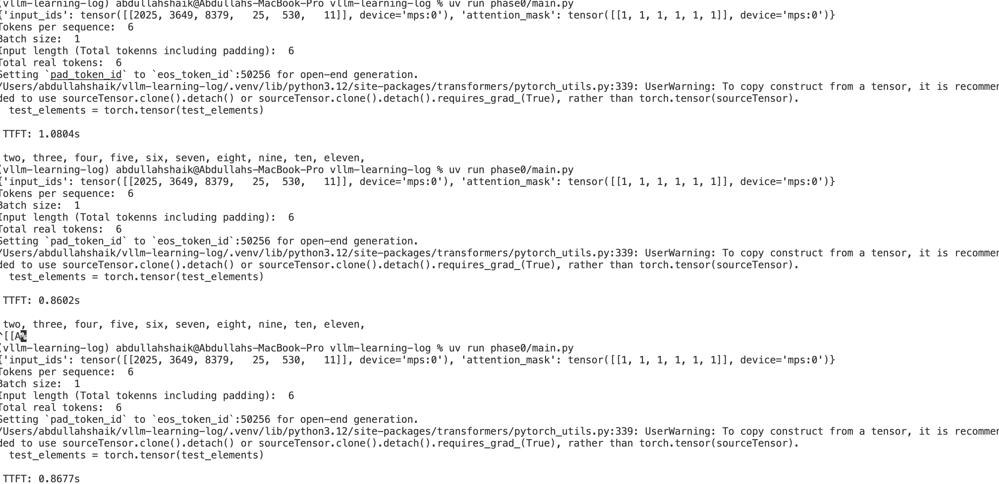

# Key metrics for LLM Inference
## Phase 0 - Time To First Token
**TTFT (Time To First Token):** The time it takes to generate the first token after sending a request. It reflects how fast the model can start responding.
This metric captures:
- model loading and tokenization
- prompt prefill latency
- first decode step

TTFT was measured using streaming generation with a separate
generation thread and `TextIteratorStreamer`.

---

### Model Configuration

- **Model**: `distilgpt2`
- **Framework**: Hugging Face Transformers
- **Device**: MPS (Apple Silicon)
- **Max New Tokens**: 20


---


### Input Prompt

```text
An increasing sequence: one,
```

### Input Token Statistics

- **Batch size**: 1
- **Tokens per sequence**: 6
- **Total input tokens (including padding)**: 6
- **Total real input tokens (non-padding)**: 6

> Note: In this benchmark, batch size is 1 and no padding is applied,
> so all token counts are equal. These fields are listed separately
> to support future benchmarking with batching and variable-length inputs.

---

### Example Output

